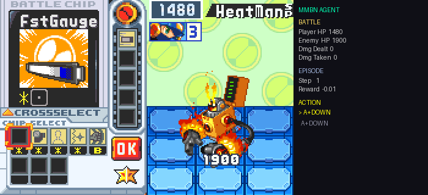

# MMBN RL Agent

Reinforcement learning agent that learns to play MegaMan Battle Network 6: Cybeast Gregar (GBA) battles using deep Q-learning with save state training.



## Stack

| Component | Tool |
|-----------|------|
| Emulator | mGBA (Python ctypes bindings) |
| RL Framework | Stable-Baselines3 (DQN + CnnPolicy) |
| ML Backend | PyTorch |
| Agent UI | pyglet |
| RAM Reading | Direct memory access for HP tracking |
| Logging | TensorBoard + JSON session logs |

## How It Works

```
Save State (boss fight)
    ↓
mGBA loads state via ctypes
    ↓
Gym Environment  ←→  DQN Agent (CNN policy)
    ↓                        ↓
 pixels               button press
    ↓                        ↓
RAM read (HP) ──→ reward signal
    ↓
win or die → reload save state → next episode
```

The agent loads a save state at a specific battle. Each episode it observes screen pixels, presses buttons, and receives rewards based on RAM-read HP values. When the enemy HP hits 0 the agent wins. When player HP hits 0 it dies. Either way the save state reloads and training continues.

### Reward System

| Event | Reward |
|-------|--------|
| Damage dealt to enemy | +1.0 per HP |
| Damage taken | -0.5 per HP |
| Enemy defeated (win) | +100.0 |
| Player defeated (death) | -50.0 |
| Time step | -0.01 |

### RAM Addresses (MMBN6 Gregar)

| Address | Value |
|---------|-------|
| `0x0203A9D4` | Player HP |
| `0x0203AAAC` | Enemy HP |

## Setup

```bash
conda create -y -p .venv python=3.12
conda activate .venv/

# Install mGBA
brew install mgba

# Build mGBA Python bindings from source
git clone --depth 1 https://github.com/mgba-emu/mgba.git /tmp/mgba-build
cd /tmp/mgba-build && mkdir build && cd build
cmake .. -DBUILD_PYTHON=ON -DBUILD_QT=OFF -DBUILD_SDL=OFF
make -j8
cp build/libmgba.0.11.dylib /path/to/project/.venv/lib/

# Install Python dependencies
pip install -r requirements.txt

# Copy ROM and save file into roms/
cp path/to/rom.gba roms/
cp path/to/save.sav "roms/Mega Man Battle Network 6 - Cybeast Gregar (USA).sav"
```

## Creating a Battle Save State

1. Launch mGBA: `python scripts/play.py`
2. Continue from your save, navigate to a battle
3. Press **Shift+F1** to save the state
4. The `.ss1` file is created next to the ROM

## Usage

### Watch the Agent

```bash
PYTHONPATH=. python scripts/watch_agent.py --state 1 --fps 15
```

The dashboard shows:
- Live game screen with correct colors
- Battle stats: Player HP, Enemy HP, damage dealt/taken (from RAM)
- Episode tracking: step count, reward, FPS
- All-time stats: wins, deaths, win rate, streaks
- Real-time action log

Controls: `P` pause, `R` reset, `Esc` save & quit

### Train the Agent

```bash
PYTHONPATH=. python scripts/train.py --timesteps 500000
```

### View Progress

```bash
PYTHONPATH=. python scripts/progress.py
```

Session logs are saved to `logs/session_log.jsonl` and progress to `logs/progress.json`.

### Play Manually (mGBA)

```bash
python scripts/play.py
```

| Key | Action |
|-----|--------|
| Arrow keys | D-pad |
| Z | B |
| X | A |
| A / S | L / R |
| Enter | Start |

## Project Structure

```
src/
  env/
    mgba_core.py      mGBA ctypes wrapper (vtable dispatch)
    mmbn_env.py        Gymnasium environment with HP rewards
    rewards.py         Progression tracking
  agent/
    trainer.py         DQN config and training logic
scripts/
  watch_agent.py       Live agent dashboard
  train.py             Train the RL agent
  play.py              Launch mGBA for manual play
  progress.py          View training stats
  capture_gif.py       Record demo GIF
assets/                Demo GIF for README
models/                Saved checkpoints (gitignored)
logs/                  Session logs + progress (gitignored)
roms/                  ROM and save files (gitignored)
```

## License

MIT
